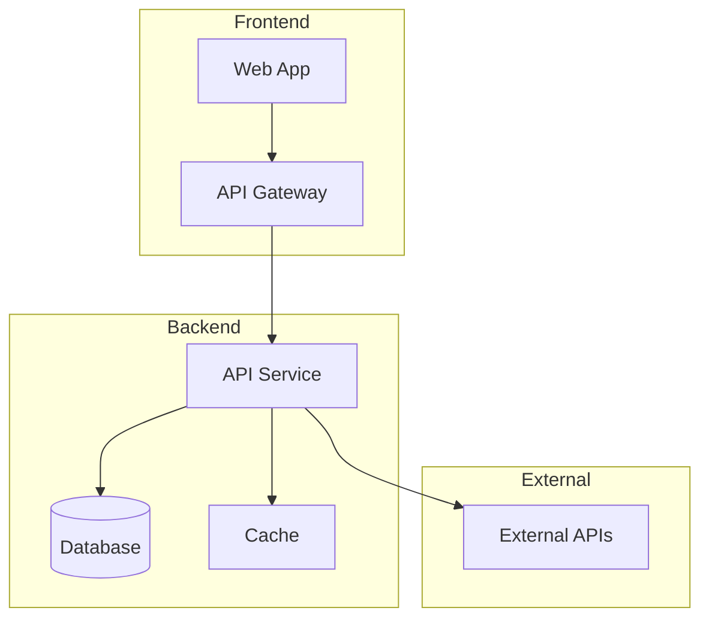
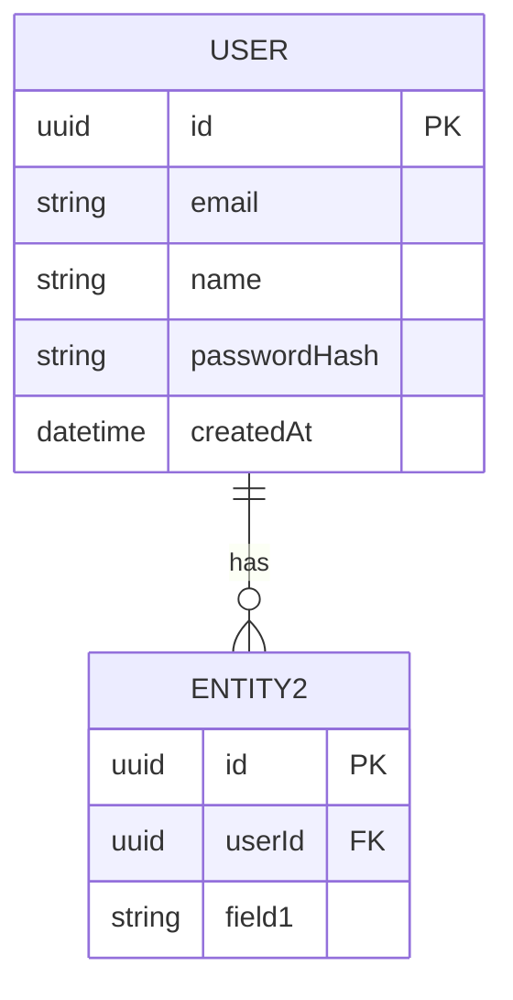
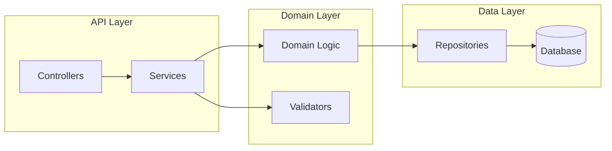
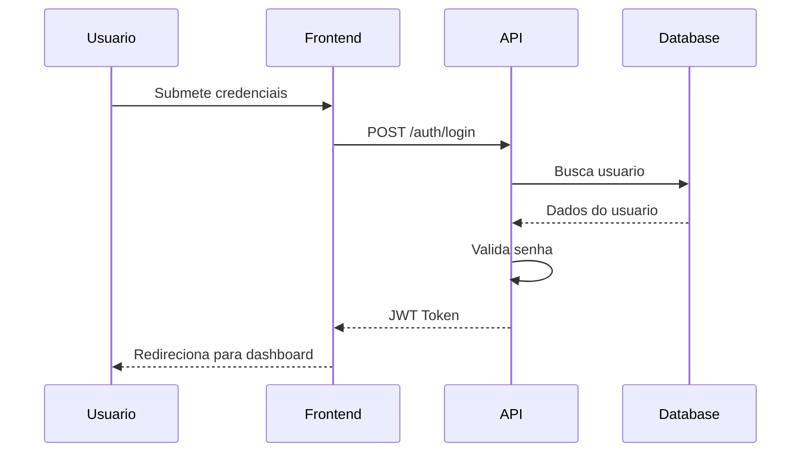

# Documento de Arquitetura
## [Nome do Projeto]

> **Documento de Arquitetura Tecnica GIPM**
> Define stack, padroes, componentes, APIs e infraestrutura.

---

## 1. Introducao

### 1.1 Visao Geral
Este documento detalha a arquitetura tecnica do [Nome do Projeto], servindo como guia para desenvolvimento consistente e auditavel seguindo o metodo GIPM.

### 1.2 Documentos de Referencia
- Project Brief: `docs/brief.md`
- PRD: `docs/prd.md`
- Frontend Architecture: `docs/frontend-architecture.md` (se aplicavel)

### 1.3 Starter Template / Projeto Base
- [ ] N/A - Projeto do zero
- [ ] Usando template: [Nome do template]
- [ ] Baseado em projeto existente: [Link/referencia]

### 1.4 Historico de Alteracoes

| Data | Versao | Descricao | Autor |
|------|--------|-----------|-------|
| [Data] | 1.0 | Versao inicial | [Nome] |

---

## 2. Arquitetura de Alto Nivel

### 2.1 Resumo Tecnico
[3-5 frases descrevendo o estilo arquitetural, componentes principais e tecnologias-chave]

### 2.2 Visao Geral da Arquitetura
- **Estilo Arquitetural:** [Monolito / Microservicos / Serverless / Event-Driven]
- **Estrutura de Repositorio:** [Monorepo / Polyrepo]
- **Decisoes Arquiteturais Principais:** [Listar decisoes criticas]

### 2.3 Diagrama de Alto Nivel



### 2.4 Padroes Arquiteturais

| Padrao | Descricao | Justificativa |
|--------|-----------|---------------|
| [Padrao 1] | [O que e] | [Por que usar] |
| [Padrao 2] | [O que e] | [Por que usar] |
| Repository Pattern | Abstracao de acesso a dados | Facilita testes e troca de DB |
| Dependency Injection | Inversao de controle | Desacoplamento e testabilidade |

---

## 3. Tech Stack

### 3.1 Infraestrutura Cloud
- **Provider:** [AWS / GCP / Azure / Vercel / etc.]
- **Servicos Principais:** [Lista de servicos]
- **Regioes:** [Regioes de deploy]

### 3.2 Tabela de Tecnologias

| Categoria | Tecnologia | Versao | Proposito | Justificativa |
|-----------|------------|--------|-----------|---------------|
| **Linguagem** | TypeScript | 5.x | Linguagem principal | Tipagem forte, tooling |
| **Runtime** | Node.js | 20.x LTS | Runtime JS | LTS, performance |
| **Framework Backend** | [NestJS/Express/etc.] | [versao] | API Backend | [justificativa] |
| **Framework Frontend** | [Next.js/React/etc.] | [versao] | Frontend | [justificativa] |
| **Banco de Dados** | [PostgreSQL/MongoDB/etc.] | [versao] | Persistencia | [justificativa] |
| **ORM/ODM** | [Prisma/TypeORM/etc.] | [versao] | Acesso a dados | [justificativa] |
| **Cache** | [Redis/Memcached] | [versao] | Cache | [justificativa] |
| **Message Queue** | [RabbitMQ/SQS/etc.] | [versao] | Mensageria | [justificativa] |
| **Testes** | [Jest/Vitest/etc.] | [versao] | Testes | [justificativa] |
| **CI/CD** | [GitHub Actions/etc.] | - | Automacao | [justificativa] |

---

## 4. Modelos de Dados

### 4.1 Entidades Principais

#### User
**Proposito:** Representa um usuario do sistema

| Atributo | Tipo | Descricao |
|----------|------|-----------|
| id | UUID | Identificador unico |
| email | String | Email do usuario |
| name | String | Nome completo |
| passwordHash | String | Hash da senha |
| createdAt | DateTime | Data de criacao |
| updatedAt | DateTime | Ultima atualizacao |

**Relacionamentos:**
- Has many [Entidade relacionada]

---

#### [Entidade 2]
**Proposito:** [Descricao do proposito]

| Atributo | Tipo | Descricao |
|----------|------|-----------|
| [attr] | [type] | [desc] |

**Relacionamentos:**
- [Relacionamento]

---

### 4.2 Diagrama de Entidades



---

## 5. Componentes

### 5.1 API Service
**Responsabilidade:** Processar requisicoes HTTP e orquestrar logica de negocio

**Interfaces:**
- REST API em `/api/v1/*`
- WebSocket em `/ws` (se aplicavel)

**Dependencias:** Database, Cache, External APIs

**Stack:** [Framework], [ORM], [Validacao]

---

### 5.2 [Componente 2]
**Responsabilidade:** [Descricao]

**Interfaces:**
- [Interface 1]

**Dependencias:** [Lista]

---

### 5.3 Diagrama de Componentes



---

## 6. APIs Externas

### 6.1 [Nome da API]
- **Proposito:** [Para que e usada]
- **Documentacao:** [URL]
- **Base URL:** `https://api.example.com/v1`
- **Autenticacao:** [API Key / OAuth / etc.]
- **Rate Limits:** [Limites]

**Endpoints Utilizados:**
- `GET /endpoint` - [Proposito]
- `POST /endpoint` - [Proposito]

**Notas de Integracao:** [Consideracoes especiais]

---

## 7. Workflows Principais

### 7.1 Autenticacao



### 7.2 [Workflow 2]

[Diagrama de sequencia...]

---

## 8. Especificacao da REST API

```yaml
openapi: 3.0.0
info:
  title: [Nome do Projeto] API
  version: 1.0.0
  description: API do [Nome do Projeto]

servers:
  - url: https://api.example.com/v1
    description: Producao
  - url: http://localhost:3000/api/v1
    description: Desenvolvimento

paths:
  /auth/login:
    post:
      summary: Autenticar usuario
      requestBody:
        required: true
        content:
          application/json:
            schema:
              type: object
              properties:
                email:
                  type: string
                password:
                  type: string
      responses:
        '200':
          description: Login bem-sucedido
        '401':
          description: Credenciais invalidas

  /users:
    get:
      summary: Listar usuarios
      security:
        - bearerAuth: []
      responses:
        '200':
          description: Lista de usuarios
```

---

## 9. Schema do Banco de Dados

```sql
-- Users table
CREATE TABLE users (
    id UUID PRIMARY KEY DEFAULT gen_random_uuid(),
    email VARCHAR(255) UNIQUE NOT NULL,
    name VARCHAR(255) NOT NULL,
    password_hash VARCHAR(255) NOT NULL,
    created_at TIMESTAMP DEFAULT CURRENT_TIMESTAMP,
    updated_at TIMESTAMP DEFAULT CURRENT_TIMESTAMP
);

-- Add indexes
CREATE INDEX idx_users_email ON users(email);

-- [Outras tabelas...]
```

---

## 10. Estrutura de Pastas

```
project-root/
├── src/
│   ├── modules/           # Modulos de negocio
│   │   ├── auth/
│   │   │   ├── auth.controller.ts
│   │   │   ├── auth.service.ts
│   │   │   └── auth.module.ts
│   │   └── users/
│   │       ├── users.controller.ts
│   │       ├── users.service.ts
│   │       └── users.module.ts
│   ├── common/            # Utilitarios compartilhados
│   │   ├── decorators/
│   │   ├── guards/
│   │   └── pipes/
│   ├── config/            # Configuracoes
│   └── main.ts            # Entry point
├── test/                  # Testes
│   ├── unit/
│   └── integration/
├── docs/                  # Documentacao
│   ├── brief.md
│   ├── prd.md
│   └── architecture.md
├── scripts/               # Scripts utilitarios
├── .github/               # GitHub Actions
│   └── workflows/
├── docker-compose.yml
├── Dockerfile
├── package.json
└── README.md
```

---

## 11. Infraestrutura e Deploy

### 11.1 Infrastructure as Code
- **Ferramenta:** [Terraform / Pulumi / CDK / etc.]
- **Localizacao:** `infrastructure/`
- **Abordagem:** [Descricao]

### 11.2 Estrategia de Deploy
- **Estrategia:** [Blue-Green / Rolling / Canary]
- **Plataforma CI/CD:** [GitHub Actions / CircleCI / etc.]
- **Config:** `.github/workflows/`

### 11.3 Ambientes

| Ambiente | Proposito | URL |
|----------|-----------|-----|
| Development | Desenvolvimento local | localhost:3000 |
| Staging | Testes pre-producao | staging.example.com |
| Production | Producao | app.example.com |

### 11.4 Fluxo de Promocao

```
feature/* → develop → staging → main → production
```

### 11.5 Estrategia de Rollback
- **Metodo Primario:** [Deploy da versao anterior]
- **Condicoes de Trigger:** [Metricas de erro, latencia]
- **RTO:** [Objetivo de tempo de recuperacao]

---

## 12. Estrategia de Tratamento de Erros

### 12.1 Abordagem Geral
- **Modelo de Erro:** [Estruturado / Exceptions / Result types]
- **Hierarquia de Exceptions:** [Descricao]
- **Propagacao:** [Regras]

### 12.2 Padroes de Logging
- **Biblioteca:** [Winston / Pino / etc.]
- **Formato:** JSON estruturado
- **Niveis:** DEBUG, INFO, WARN, ERROR, FATAL

**Contexto Obrigatorio:**
- Correlation ID
- Service name
- User ID (quando autenticado)

### 12.3 Padroes de Tratamento

#### Erros de API Externa
- **Retry Policy:** Exponential backoff, max 3 tentativas
- **Circuit Breaker:** Abre apos 5 falhas em 30s
- **Timeout:** 10s padrao

#### Erros de Logica de Negocio
- Exceptions customizadas com codigos de erro
- Mensagens user-friendly separadas de detalhes tecnicos

---

## 13. Padroes de Codigo

### 13.1 Padroes Core
- **Linguagens:** TypeScript 5.x (strict mode)
- **Linting:** ESLint + Prettier
- **Organizacao de Testes:** `*.spec.ts` ao lado do arquivo fonte

### 13.2 Convencoes de Nomenclatura

| Elemento | Convencao | Exemplo |
|----------|-----------|---------|
| Classes | PascalCase | UserService |
| Interfaces | PascalCase com I | IUserRepository |
| Funcoes | camelCase | getUserById |
| Variaveis | camelCase | userName |
| Constantes | UPPER_SNAKE_CASE | MAX_RETRY_COUNT |
| Arquivos | kebab-case | user-service.ts |

### 13.3 Regras Criticas
- **NUNCA** usar `any` - sempre tipar explicitamente
- **NUNCA** commitar secrets ou credenciais
- **SEMPRE** usar async/await (nunca callbacks)
- **SEMPRE** validar input em controllers
- **SEMPRE** usar prepared statements para queries

---

## 14. Estrategia de Testes

### 14.1 Filosofia de Testes
- **Abordagem:** TDD quando possivel
- **Coverage Goals:** 80% minimo
- **Piramide:** 70% unit, 20% integration, 10% e2e

### 14.2 Testes Unitarios
- **Framework:** Jest
- **Naming:** `[feature].spec.ts`
- **Localizacao:** Ao lado do arquivo fonte
- **Mocking:** Jest mocks

### 14.3 Testes de Integracao
- **Escopo:** Modulos + Database
- **Localizacao:** `test/integration/`
- **Infraestrutura:** Testcontainers / Docker

### 14.4 Testes E2E
- **Framework:** [Playwright / Cypress]
- **Escopo:** Fluxos criticos do usuario
- **Ambiente:** Staging

---

## 15. Seguranca

### 15.1 Validacao de Input
- **Biblioteca:** [class-validator / Zod / etc.]
- **Localizacao:** Controllers (API boundary)
- **Abordagem:** Whitelist (aceitar somente campos conhecidos)

### 15.2 Autenticacao e Autorizacao
- **Metodo:** JWT com refresh tokens
- **Sessao:** Stateless
- **Padroes:**
  - Tokens expiram em 15 minutos
  - Refresh tokens expiram em 7 dias
  - RBAC para autorizacao

### 15.3 Gestao de Secrets
- **Desenvolvimento:** .env (gitignored)
- **Producao:** [AWS Secrets Manager / Vault / etc.]
- **Regras:**
  - NUNCA hardcode secrets
  - Acessar apenas via config service
  - Nunca logar secrets

### 15.4 Seguranca de API
- **Rate Limiting:** 100 req/min por IP
- **CORS:** Whitelist de dominios permitidos
- **Headers:** Helmet.js para headers de seguranca
- **HTTPS:** Obrigatorio em todos ambientes

### 15.5 Protecao de Dados
- **Em Repouso:** Criptografia de database
- **Em Transito:** TLS 1.3
- **PII:** Hash de dados sensiveis, mascaramento em logs

---

## 16. Proximos Passos

### Para Frontend Architecture
Se o projeto tem componentes de UI, crie um documento separado de Frontend Architecture detalhando:
- Estrutura de componentes
- Gerenciamento de estado
- Padroes de styling
- Acessibilidade

### Para Desenvolvimento
Use este documento junto com o PRD para implementar as stories. Cada desenvolvedor deve ler as secoes relevantes antes de comecar.

---

## Checklist de Revisao

- [ ] Tech stack completamente especificado com versoes
- [ ] Diagramas de arquitetura claros
- [ ] Modelos de dados definidos
- [ ] APIs documentadas
- [ ] Padroes de seguranca especificados
- [ ] Estrategia de testes definida
- [ ] Estrutura de pastas clara
- [ ] Deploy strategy documentada

---

> **Gerado com GIPM - Metodo de Projetos com IA Governada**
> https://github.com/inematds/GIPM
